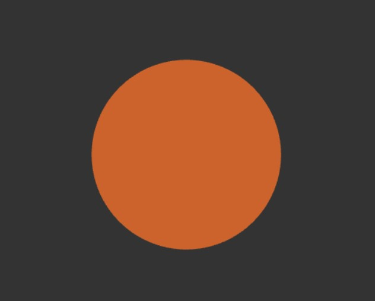
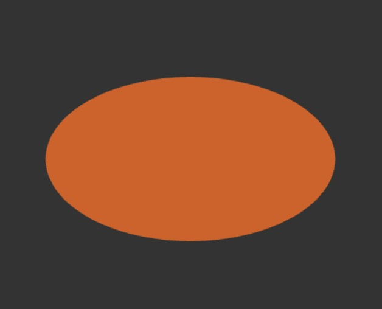
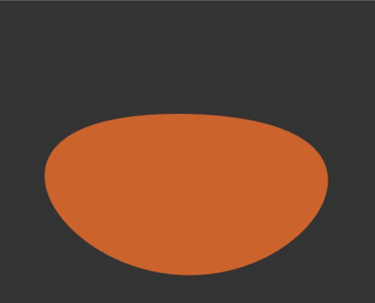
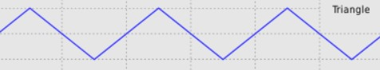
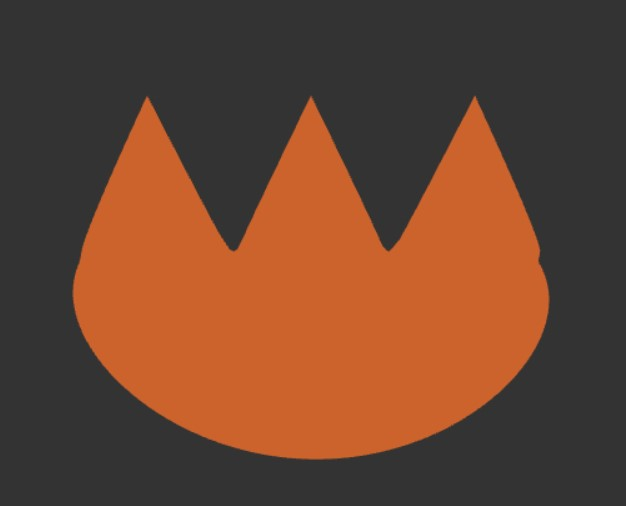

# Making Ember from Elemental, Procedurally!
As I delve deeper into the world of Procedural Graphics, I wanted to use the various tools that this field equipped me with to create something close to my heart. Ember from Elemental (Pixar Animation Studios) was a character that I resonated with very deeply, and hence I wanted to use my learnings of Toolbox functions, noise functions, and WebGL to try to create her! [Try ineracting with her yourself!](https://saksham03.github.io/Elemental/)
Here is what I ended up with (GIF isn't super high-res, screenshot attached later) :  
  
Overall, I am pretty happy with the final result! I loved the artistic journey I was able to go on with this project, and develop an analytical thinking of using maths to create cool graphics. I will try documenting my 'art direction' below, both for my own sake for later reference and for anybody else who might be interested :)

## 1. Basics - Structure of Ember's Head
The first step was of course to create the basic structure. I have used an icosphere mesh for all parts of Ember. I then use various mathematical functions to tweak it shape to make it look like waht I want. For the head, my sequential train of thought (with results) is as follows:
1. First, I squish (scale) the sphere to distort into a capsule-looking shape. Then, I apply a scaled sine wave to all the vertices to give the head a smiley-looking appearance. A section of the downard trend of the sin curve does the trick for me.

|  |  |  |
|:--:|:--:|:--:|
| *<b>(a)</b> Starting with an icosphere* | *<b>(b)</b> Scaling to give the capsule look* |  *<b>(c)</b> Sine wave gives the smiley-looking shape* |

2. Next, I wanted to add the 3 triangle-looking structures on her head. For this, I mapped a triangle wave of appropriate frequency and amplitude on the top part of her head :

|    **+**   |=  |
|:--:|:--:|

3. Now, I wanted to make the middle triangle on Ember's head a bit taller than the other two. For this, I used a square wave as a signal. I used a shifted square wave with half the frequency as that of the triangle wave so that the signal will be 1 only in the middle, where the middle-most triangle is. I was then able to scale it up accordingly :

