# Making Ember from Elemental, Procedurally!
As I delve deeper into the world of Procedural Graphics, I wanted to use the various tools that this field equipped me with to create something close to my heart. Ember from Elemental (Pixar Animation Studios) was a character that I resonated with very deeply, and hence I wanted to use my learnings of Toolbox functions, noise functions, and WebGL to try to create her! [Try interacting with her yourself!](https://saksham03.github.io/Elemental/)
Here is what I ended up with (GIF isn't super high-res, screenshot attached later) :  
  
Overall, I am pretty happy with the final result! I loved the artistic journey I was able to go on with this project, and develop an analytical thinking of using maths to create cool graphics. I will try documenting my 'art direction' below, both for my own sake for later reference and for anybody else who might be interested :)

## 1. Basics - Structure of Ember's Head
The first step was of course to create the basic structure. I have used an icosphere mesh for all parts of Ember. I then use various mathematical functions to tweak it shape to make it look like what I want. For the head, my sequential train of thought (with results) was as follows:
1. First, I squish (scale) the sphere to distort into a capsule-looking shape. Then, I apply a scaled sine wave to all the vertices to give the head a smiley-looking appearance. A section of the downard trend of the sin curve does the trick for me.

|  |  |  |
|:--:|:--:|:--:|
| *<b>(a)</b> Starting with an icosphere* | *<b>(b)</b> Scaling to give the capsule look* |  *<b>(c)</b> Sine wave gives the smiley-looking shape* |

2. Next, I wanted to add the 3 triangle-looking structures on her head. For this, I mapped a triangle wave of appropriate frequency and amplitude on the top part of her head :

|    **+**   |=  |
|:--:|:--:|

3. Now, I wanted to make the middle triangle on Ember's head a bit taller than the other two. For this, I used a square wave as a signal. I used a shifted square wave with half the frequency as that of the triangle wave so that the signal will be 1 only in the middle, where the middle-most triangle is. I was then able to scale it up accordingly :

| 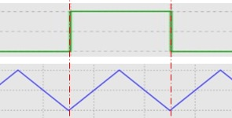   **+**   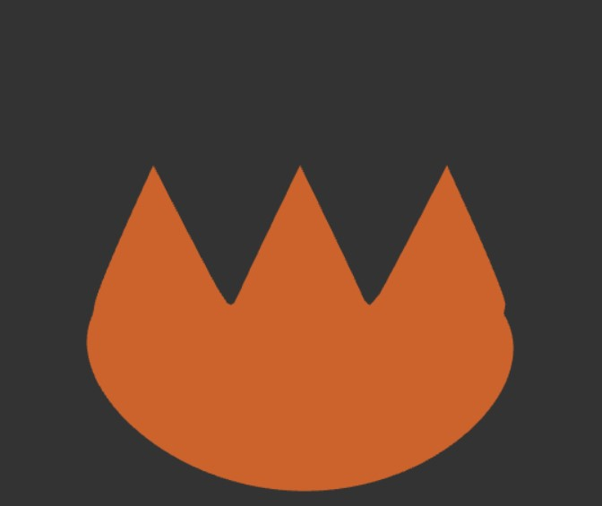|= 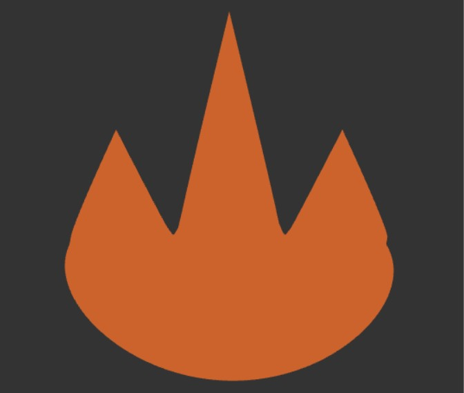 |
|:--:|:--:|

4. Finally, I added some **3D Perlin noise** on the top part. I chose it because in my (little) experience, 3D Perlin noise can be tweaked to get the nice flamey/wavy look. For the bottom part, I add a high frequency low amplitude **3D FBM Noise** to give the surface that 'fiery' boiling look. Next up, I added an iridescent shader to give a gradient color palette to the surface that is made up of nice flame colors. I used [this](http://dev.thi.ng/gradients/) source to get the perfect **Cosine Color Gradient Palette** I wanted. The iridescent shader works using the geometry's normals, which gives it the required gradient at any viewing angle.

|  | 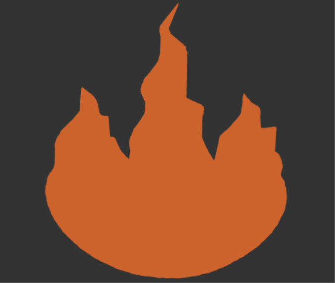 |  | 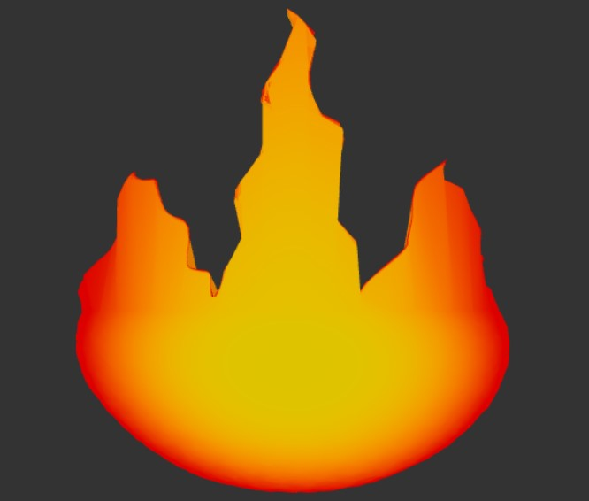 |
|:--:|:--:|:--:|:--:|
| *Adding time-varying 3D Perlin & FBMs* | *Ember is slowly coming to life!* | *Adding the cosine color palette* | *Screenshot of the iridescent shader for resolution* |  

## 2. Moving on - making the Eyebrows
The eyebrows were an easy win. I started with an icosphere again, squished it into a capsule, and applied a shifted sine curve to give it the appropriate look. It was funny as to how complex I was initally making it, and how just a simple sine wave worked so well for me. I reused the iridescent shader to match Ember's actual look from the movie.  
| 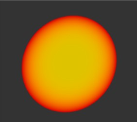 | 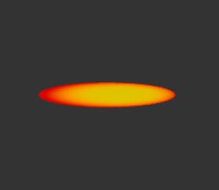 | 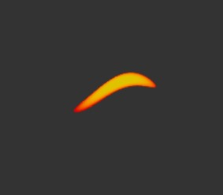 | 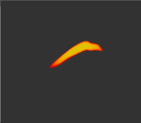 |
|:--:|:--:|:--:|:--:|
| *Starting with an icosphere* | *Simple scaling/squishing* | *Adding a shifted sine wave* | *aaand done* |

## 3. Making the Eyes
The eyes were a fun process. My first thought was to use shifted power curves:  
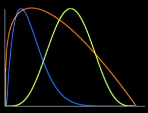  
And when I was looking at [Inigo Quilez's Blog](https://iquilezles.org/articles/functions/) for motivation, him precisely mentioning the use of power curves for eyes gave me a temporary ego boost. I used two different power curves for the top and the bottom halves of the eye. I chalked out a quick [desmos](https://www.desmos.com/calculator/u7g4m31wqp) to test my imagination, so feel free to play around with it!

1. For the Top portion:

|  |  |  |
|:--:|:--:|:--:|
| *Starting with an icosphere. Again.* | *For demonstration, taking off the bottom* | *Added a power curve a=0.4 b=0.6, scale=0.16* |

2. For the bottom portion:

|  |  | 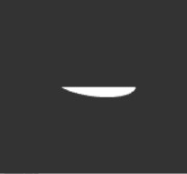 |
|:--:|:--:|:--:|
| *Starting with an icosphere. Again.* | *For demonstration, taking off the top* | *Added a power curve a=0.5, b-0.8, scale=0.06* |

3. Finally combining them together:

|    **+**   |=   |
|:--:|:--:|

## 4. Making the Eyelashes
This waas probably the most fun part for me personally. I developed a thinking of how various toolbox functions could be employed for a variety of use cases, and was proud of the result that came out of this process.
1. I start, again, with an icosphere. For the top part, I first again apply a power curve :

| 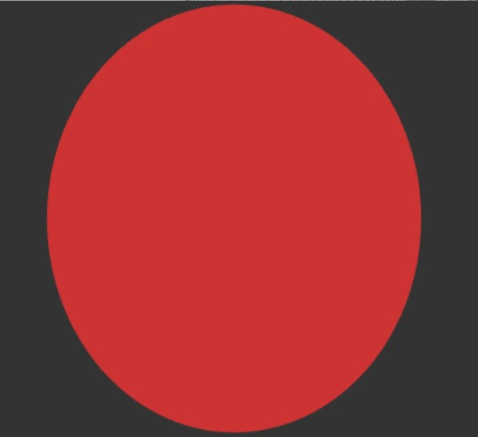 | 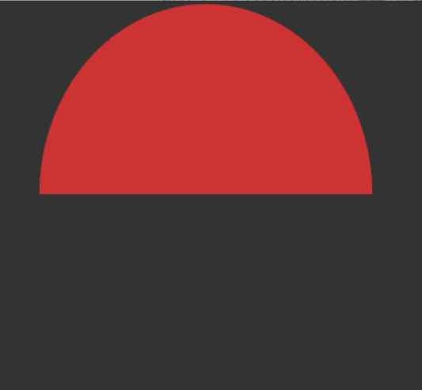 |  |
|:--:|:--:|:--:|
| *Starting with an icosphere. Again.* | *For demonstration, taking off the bottom* | *Added a power curve* |

2. Next, I wanted to add the lashes on to this structure. For this, I used a saw-tooth curve:

| 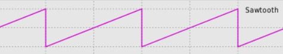   **+**   |=   |
|:--:|:--:|

3. I wanted to give the eyelashes a curvey look to match the reference image better. For this, I used the bias function on top of the sawtooth curve in the previous step which gave me nice-looking eyelashes:

|    **+**   |=  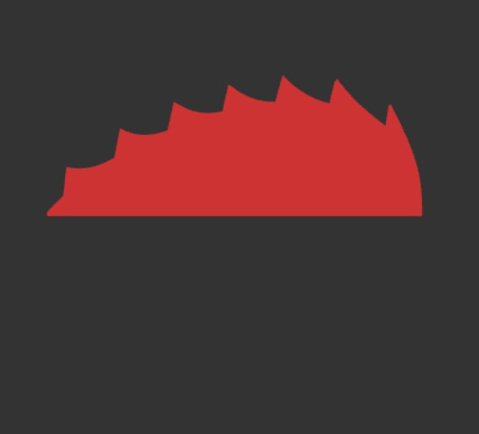 |
|:--:|:--:|

4. The bottom part was easy, same as the eye's bottom part. Just a power curve:

|  |  |  |
|:--:|:--:|:--:|
| *Starting with an icosphere. Again.* | *For demonstration, taking off the top* | *Added a power curve* |

5. Finally, combining the two parts, I get my beautiful eyelash!

|     **+**    |=  |
|:--:|:--:|

## 5. The Eyeballs
I was fortunately able to get done with this pretty quickly. Well, I did spend more time on this than I should have, but nonetheless this was simple. First, I added FBM noise to color the iris to give it a fiery look. Next, to make the pupils black, I simply used the coordinates mapped to the X-Y plane and used a fraction of the eyeball's radius to color a smaller radius black.

| 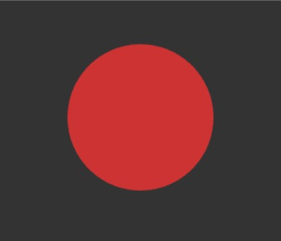 | 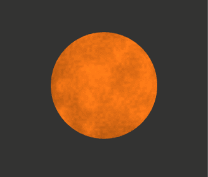 | 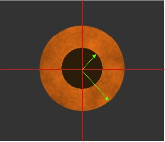 | 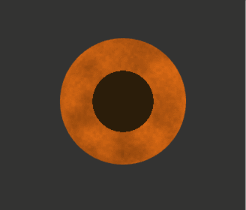 |
|:--:|:--:|:--:|:--:|
| *Starting with an icosphere, of course.* | *Adding FBM noise to the color* | *Use the XY coordinates to color the pupil* | *Final result* |

## 6. Finally...
Once I had all the indiviudal pieces of the puzzle done as described above, I used apprporiate model matrices to find appropriate postions for them. I added some user controls on the UI to enable some level of interactivity. And, comparing to a reference image, my final result doesn't look that bad!
| 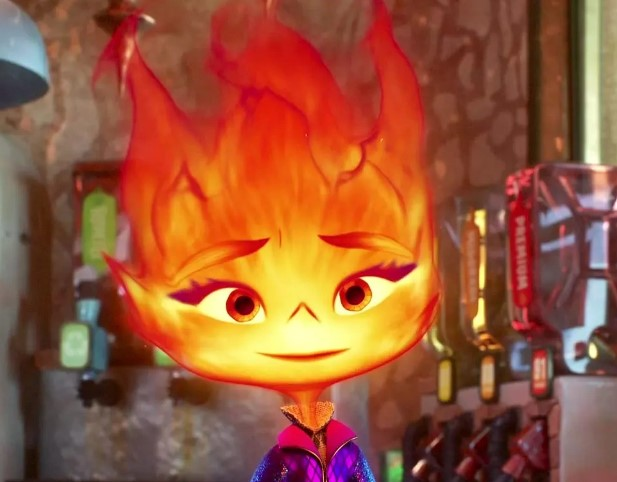 | 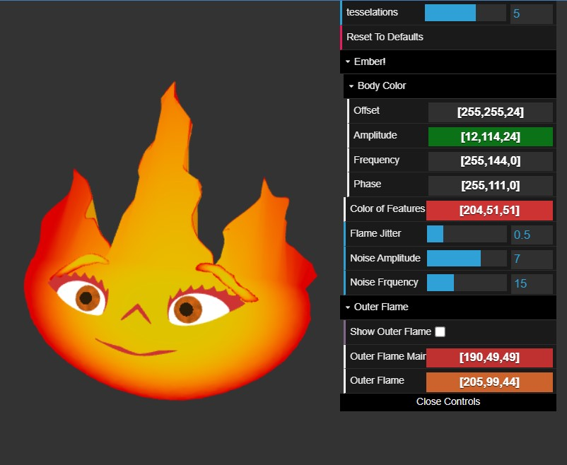 |
|:--:|:--:|
| *Reference Image* | *Final Result. Not bad!* |

I showed it to someone without context and they immediately went 'Oh! It is Ember from Elemental!'. I was just happy about the fact that it was recognizable to others :)

## An Experiment
I was trying to get a volumetric flame-looking appearance around the face and the top part of Ember's head to match the look from the movie. However, the scaled geometry and weird mesh shape kept coming in my way. I was trying to use **FBM-interbed 3D Worley Noise** to drive the alpha channel for the final color. I used backface culling to keep the effect from covering Ember's face. The final output didn't look that appealing to me, but I did not want to throw it away. Hence I added a checkbox on the UI called _Show Outer Flame_ that is unchecked by default. If a user was to check it, they would see something like this: 
  

And that is all! I had so much fun with this project. Hopefully I will be able to find motivation to fix the volumetric effect I was looking for, and maybe make her companion Wade as well at some point!
